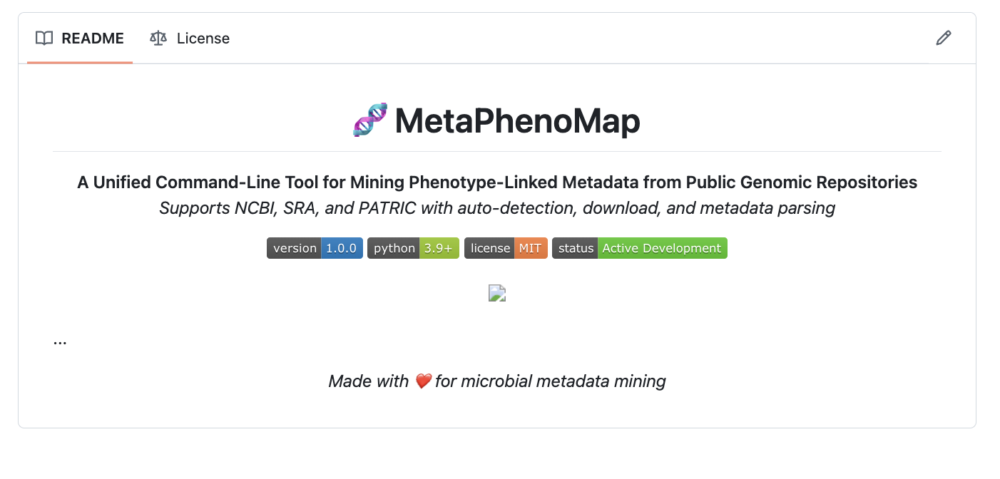

<h1 align="center">
  🧬 MetaPhenoMap
</h1>

  <b>A Unified Command-Line Tool for Mining Phenotype-Linked Metadata from Public Genomic Repositories</b> 
  <i>Supports NCBI, SRA, and PATRIC with auto-detection, download, and metadata parsing</i>

  
  
  
  

  

...

<i>Made with ❤️ for microbial metadata mining</i>
